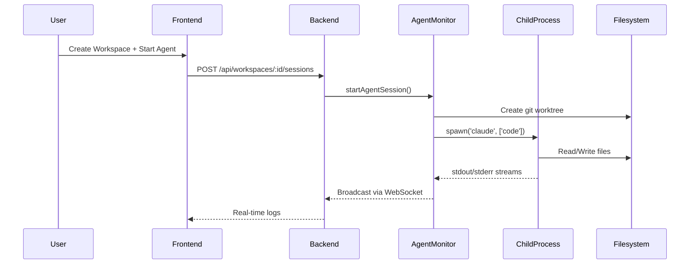

# Sandbox Integration Analysis for Parawork

**Document Version:** 1.0
**Date:** 2026-01-04
**Author:** Claude (Sonnet 4.5)
**Status:** Analysis & Planning

---

## Executive Summary

This document analyzes the feasibility, implications, and approaches for integrating **secure sandbox execution** into Parawork. It compares two primary solutions (**E2B** and **Cloudflare Sandbox**), evaluates architectural impacts, assesses trade-offs, and provides implementation recommendations.

**Key Findings:**

- **E2B integration is highly feasible** with minimal architectural changes (5-8 hours implementation)
- **Cloudflare Sandbox requires major rewrite** (80+ hours, fundamentally different architecture)
- **Sandboxing provides security, isolation, and multi-tenancy** but adds complexity and cost
- **Hybrid approach recommended**: Optional sandboxing with local execution fallback
- **Estimated cost impact**: $0.10-0.40/hour per active workspace (E2B usage-based pricing)

---

## Table of Contents

1. [Problem Statement](#1-problem-statement)
2. [Current Architecture Analysis](#2-current-architecture-analysis)
3. [Why Consider Sandboxing?](#3-why-consider-sandboxing)
4. [Sandbox Solution Comparison](#4-sandbox-solution-comparison)
5. [Technical Integration Architecture](#5-technical-integration-architecture)
6. [Security Analysis](#6-security-analysis)
7. [Performance & Scalability Impact](#7-performance--scalability-impact)
8. [User Experience Impact](#8-user-experience-impact)
9. [Cost Analysis](#9-cost-analysis)
10. [Implementation Roadmap](#10-implementation-roadmap)
11. [Risk Assessment](#11-risk-assessment)
12. [Alternative Approaches](#12-alternative-approaches)
13. [Decision Framework](#13-decision-framework)
14. [Recommendations](#14-recommendations)

---

## 1. Problem Statement

### 1.1 Current Security Posture

Parawork currently executes AI agents (Claude Code, Codex) as **local child processes** on the host machine:

```typescript
// Current approach (simplified)
const agentProcess = spawn('claude', ['code'], {
  cwd: workspace.path,
  stdio: 'pipe'
});
```

**Implications:**

- ✅ Simple, fast, no external dependencies
- ✅ Direct filesystem access (no sync overhead)
- ✅ Zero infrastructure cost
- ❌ Agents run with host machine permissions
- ❌ No resource isolation between workspaces
- ❌ Malicious/buggy code can affect host system
- ❌ No multi-tenancy support (all users share host resources)
- ❌ Difficult to track per-workspace resource usage

### 1.2 What Could Go Wrong?

**Without sandboxing, AI agents could:**

1. **Filesystem risks:**

   - Delete files outside workspace directory (e.g., `rm -rf /`)
   - Read sensitive files (e.g., `~/.ssh/id_rsa`, environment variables)
   - Modify system configuration files
2. **Resource exhaustion:**

   - Consume 100% CPU/RAM (blocking other workspaces)
   - Fork bomb attacks
   - Fill disk with large files
3. **Network abuse:**

   - Make unauthorized API calls
   - DDoS attacks from your server
   - Cryptocurrency mining
4. **Multi-user risks:**

   - User A's agent reading User B's workspace
   - Shared state pollution
   - No billing/usage tracking per user

**Real-world scenario:**

```
User asks Claude Code: "Optimize all images in this directory"
Claude generates: `find / -name "*.jpg" -exec convert {} -quality 50 {} \;`
                   ↑ Starts from root instead of workspace!
Result: Corrupts all images on host machine
```

### 1.3 When Does This Matter?

**Low risk scenarios (current Parawork use):**

- Single developer running on local machine
- Trusted users only
- Development/testing environment
- No multi-tenancy

**High risk scenarios (future growth):**

- Multi-user SaaS deployment
- Untrusted users or code
- Production environments
- Customer data on same machine
- Usage-based billing requirements

---

## 2. Current Architecture Analysis

### 2.1 Agent Execution Flow



### 2.2 Key Files Involved


| File                                      | Responsibility                     | Lines of Code |
| ----------------------------------------- | ---------------------------------- | ------------- |
| `packages/backend/src/agents/monitor.ts`  | Agent process spawning & lifecycle | ~200-300      |
| `packages/backend/src/api/websocket.ts`   | Real-time communication            | ~150-200      |
| `packages/backend/src/db/queries.ts`      | Database operations                | ~300-400      |
| `packages/backend/src/config/settings.ts` | Configuration management           | ~100-150      |
| `packages/shared/src/types.ts`            | Type definitions                   | ~200-300      |

### 2.3 Current Isolation Model

**Git Worktree Approach:**

- Main project on `main` branch
- Each workspace = separate git worktree
- Isolation is **logical** (directory-based), not security-based
- All worktrees share same filesystem, user permissions, resources

**Limitations:**

- Directory boundaries are not security boundaries
- Agent can navigate to parent directories (`cd ../..`)
- All agents share system resources (no quotas)
- Process-level isolation only (weak against malicious code)

---

## 3. Why Consider Sandboxing?

### 3.1 Benefits Matrix


| Benefit                 | Impact | Priority | Notes                                    |
| ----------------------- | ------ | -------- | ---------------------------------------- |
| **Security Isolation**  | High   | Critical | Protects host from malicious/buggy code  |
| **Resource Management** | High   | High     | CPU/RAM limits per workspace             |
| **Multi-Tenancy**       | High   | Medium   | Safe SaaS deployment with multiple users |
| **Usage Tracking**      | Medium | Medium   | Billing, analytics, quota enforcement    |
| **Reproducibility**     | Medium | Low      | Consistent environments                  |
| **Auditability**        | Medium | Low      | Track all actions within sandbox         |
| **Compliance**          | Low    | Low      | Meets security standards (SOC2, etc.)    |

### 3.2 Use Cases That Require Sandboxing

1. **Multi-User SaaS Deployment**

   - Scenario: 100 users running agents simultaneously
   - Risk: User A's agent can read User B's workspace
   - Solution: Each user's workspace in isolated sandbox
2. **Untrusted Code Execution**

   - Scenario: User uploads third-party scripts
   - Risk: Script contains malware or backdoors
   - Solution: Execute in isolated environment
3. **Resource Quotas**

   - Scenario: Free tier users limited to 1 CPU, 512MB RAM
   - Risk: Without enforcement, can consume unlimited resources
   - Solution: Sandbox with resource limits
4. **Public Demo/Playground**

   - Scenario: Try Parawork without signup
   - Risk: Anonymous users can abuse system
   - Solution: Sandboxed execution with strict limits
5. **Enterprise Deployment**

   - Scenario: Company runs Parawork with sensitive code
   - Risk: Agent could leak proprietary information
   - Solution: Network-isolated sandboxes

### 3.3 Use Cases That DON'T Need Sandboxing

1. **Single Developer Local Setup**

   - Running Parawork on personal machine
   - Only you have access
   - Trust your own usage
2. **Small Team Internal Tool**

   - 3-5 trusted developers
   - All on same team with shared access
   - No external users
3. **Development/Testing**

   - Sandboxing adds overhead to dev workflow
   - Local execution faster for iteration

**Conclusion:** Sandboxing is a **growth enabler**, not immediately critical for current single-user use case.

---

## 4. Sandbox Solution Comparison

### 4.1 E2B (Enterprise AI Agent Cloud)

**Architecture:**

- Firecracker microVMs (AWS Lambda technology)
- Standalone cloud service with REST API
- SDKs for JavaScript, Python, CLI

**Integration Complexity:** ⭐⭐ (Low)

**Pros:**

- ✅ Minimal code changes (drop-in replacement for child_process)
- ✅ Terminal-based execution (matches current agent UX)
- ✅ Open-source with self-hosting option
- ✅ Free tier ($100 credit) for testing
- ✅ Long sessions (24 hours)
- ✅ Pause/resume sandboxes
- ✅ Custom templates (pre-install Claude Code)
- ✅ Git repository cloning built-in
- ✅ File sync utilities
- ✅ No platform lock-in

**Cons:**

- ❌ External dependency (cloud service)
- ❌ Usage-based costs (~$0.10/hour per workspace)
- ❌ File synchronization overhead (host ↔ sandbox)
- ❌ Network latency (sandbox in cloud, not local)
- ❌ Requires E2B account and API key

**Best For:**

- Multi-user SaaS deployments
- Production environments
- Teams wanting managed sandboxing
- Projects needing long-running sessions

### 4.2 Cloudflare Sandbox SDK

**Architecture:**

- Cloudflare Workers + Durable Objects + Containers
- Integrated with Cloudflare's edge network
- TypeScript-only SDK

**Integration Complexity:** ⭐⭐⭐⭐⭐ (Very High)

**Pros:**

- ✅ Global edge distribution (low latency worldwide)
- ✅ Cloudflare ecosystem integration (R2, D1, Workers)
- ✅ Git operations built-in
- ✅ Preview URLs for services
- ✅ VM-based isolation

**Cons:**

- ❌ **Requires complete rewrite** (Express → Workers)
- ❌ Workers Paid plan required (no free tier)
- ❌ Platform lock-in (Cloudflare-only)
- ❌ Beta status (APIs may change)
- ❌ Docker required locally (development overhead)
- ❌ SQLite → D1 or external DB migration
- ❌ WebSocket → Durable Objects WebSocket
- ❌ Steeper learning curve

**Best For:**

- New projects starting from scratch
- Teams already invested in Cloudflare
- Global edge distribution requirements
- Applications built on Workers architecture

### 4.3 Other Options


| Solution            | Type               | Pros                            | Cons                                 |
| ------------------- | ------------------ | ------------------------------- | ------------------------------------ |
| **Docker**          | Container platform | Industry standard, full control | Complex setup, resource overhead     |
| **Firecracker**     | microVM            | Ultra-lightweight, AWS uses it  | Low-level, requires infra management |
| **gVisor**          | Container runtime  | Strong isolation                | Performance overhead                 |
| **Kata Containers** | Lightweight VMs    | VM security + container speed   | Complex deployment                   |
| **LXC/LXD**         | System containers  | Native Linux integration        | Requires root, complex networking    |

**Why not Docker?**

- Requires Docker daemon running on host
- Complex multi-container orchestration
- Still shares kernel with host (weaker isolation than VMs)
- Resource management more complex
- Not purpose-built for AI agent workloads

**Verdict:** E2B and Cloudflare are purpose-built for code execution sandboxing, more polished than rolling your own Docker solution.

### 4.4 Decision Matrix


| Criteria                 | E2B        | Cloudflare | Docker (DIY) | None (Current) |
| ------------------------ | ---------- | ---------- | ------------ | -------------- |
| **Ease of Integration**  | ⭐⭐⭐⭐   | ⭐         | ⭐⭐⭐       | ⭐⭐⭐⭐⭐     |
| **Security Isolation**   | ⭐⭐⭐⭐⭐ | ⭐⭐⭐⭐⭐ | ⭐⭐⭐⭐     | ⭐             |
| **Cost Efficiency**      | ⭐⭐⭐⭐   | ⭐⭐⭐     | ⭐⭐⭐⭐⭐   | ⭐⭐⭐⭐⭐     |
| **Performance**          | ⭐⭐⭐⭐   | ⭐⭐⭐⭐   | ⭐⭐⭐       | ⭐⭐⭐⭐⭐     |
| **Flexibility**          | ⭐⭐⭐⭐⭐ | ⭐⭐       | ⭐⭐⭐⭐     | ⭐⭐⭐         |
| **Vendor Lock-in**       | ⭐⭐⭐⭐   | ⭐         | ⭐⭐⭐⭐⭐   | ⭐⭐⭐⭐⭐     |
| **Operational Overhead** | ⭐⭐⭐⭐⭐ | ⭐⭐⭐     | ⭐⭐         | ⭐⭐⭐⭐⭐     |
| **Multi-Tenancy**        | ⭐⭐⭐⭐⭐ | ⭐⭐⭐⭐⭐ | ⭐⭐⭐⭐     | ⭐             |

---

## 5. Technical Integration Architecture

### 5.1 E2B Integration Architecture

#### 5.1.1 High-Level Design

```
┌─────────────────────────────────────────────────────────────┐
│                         Parawork                             │
│  ┌──────────────┐         ┌──────────────┐                  │
│  │   Frontend   │◄────────┤   Backend    │                  │
│  │   (React)    │ WebSocket│  (Express)   │                  │
│  └──────────────┘         └──────┬───────┘                  │
│                                   │                           │
│                          ┌────────▼────────┐                 │
│                          │ SandboxManager  │                 │
│                          │  (Abstraction)  │                 │
│                          └────────┬────────┘                 │
│                                   │                           │
│                    ┌──────────────┴──────────────┐           │
│                    │                              │           │
│              ┌─────▼──────┐              ┌───────▼─────┐    │
│              │   Local     │              │   E2B       │    │
│              │  Executor   │              │  Executor   │    │
│              └─────┬──────┘              └───────┬─────┘    │
│                    │                              │           │
└────────────────────┼──────────────────────────────┼──────────┘
                     │                              │
                     │                              │
            ┌────────▼────────┐          ┌─────────▼─────────┐
            │  child_process  │          │  E2B Cloud API    │
            │  (Local Agent)  │          │  ┌─────────────┐  │
            └─────────────────┘          │  │  Sandbox 1  │  │
                                         │  │ ┌─────────┐ │  │
                                         │  │ │ Claude  │ │  │
                                         │  │ │  Code   │ │  │
                                         │  │ └─────────┘ │  │
                                         │  └─────────────┘  │
                                         │  ┌─────────────┐  │
                                         │  │  Sandbox 2  │  │
                                         │  │ ┌─────────┐ │  │
                                         │  │ │  Codex  │ │  │
                                         │  │ └─────────┘ │  │
                                         │  └─────────────┘  │
                                         └───────────────────┘
```

#### 5.1.2 Component Design

**New Components:**

1. **`SandboxManager` (new file: `packages/backend/src/agents/sandboxManager.ts`)**

   - Abstract interface for sandbox providers
   - Manages sandbox lifecycle
   - Handles provider switching (E2B vs Local)
2. **`E2BSandboxExecutor` (new file: `packages/backend/src/agents/executors/e2b.ts`)**

   - E2B-specific implementation
   - Sandbox creation, file sync, command execution
   - Error handling and reconnection logic
3. **`LocalSandboxExecutor` (new file: `packages/backend/src/agents/executors/local.ts`)**

   - Existing child_process logic (refactored)
   - Backward compatibility

**Modified Components:**

1. **`packages/backend/src/agents/monitor.ts`**

   - Replace direct `spawn()` calls with `SandboxManager.createExecutor()`
   - Add sandbox lifecycle callbacks
2. **`packages/backend/src/config/settings.ts`**

   - Add sandbox configuration schema
3. **`packages/backend/src/db/schema.sql`**

   - Add `sandbox_id`, `sandbox_provider` to `sessions` table
4. **`packages/backend/src/db/queries.ts`**

   - Add queries for sandbox metadata
5. **`packages/shared/src/types.ts`**

   - Add `SandboxProvider` enum, `SandboxConfig` interface

#### 5.1.3 Data Flow

**Workspace Creation & Agent Start:**

```typescript
// 1. User creates workspace with sandbox option
POST /api/workspaces
{
  name: "Feature-ABC",
  path: "/path/to/project",
  useSandbox: true  // NEW
}

// 2. Backend creates workspace record
const workspace = await createWorkspace({...});

// 3. User starts agent session
POST /api/workspaces/:id/sessions
{
  agentType: "claude-code"
}

// 4. Backend determines execution strategy
const executor = await SandboxManager.createExecutor(
  workspace.useSandbox ? 'e2b' : 'local',
  workspace,
  agentType
);

// 5a. E2B Path:
const sandbox = await e2b.Sandbox.create();
await sandbox.run(`git clone ${workspace.gitUrl} /workspace`);
const terminal = await sandbox.run('cd /workspace && claude code');

// 5b. Local Path (existing):
const process = spawn('claude', ['code'], { cwd: workspace.path });

// 6. Stream output (same for both)
terminal.stdout.on('data', (chunk) => {
  broadcastLog(workspace.id, chunk);
});
```

**File Synchronization:**

```typescript
// Challenge: Parawork UI needs to show file changes
// E2B sandbox has separate filesystem

// Option 1: Periodic sync (pull changes from sandbox)
setInterval(async () => {
  const changedFiles = await sandbox.listChangedFiles('/workspace');
  for (const file of changedFiles) {
    const content = await sandbox.readFile(file);
    await saveToLocalCache(workspace.id, file, content);
    broadcastFileChange(workspace.id, file);
  }
}, 5000); // Every 5 seconds

// Option 2: Filesystem watcher (E2B supports this)
const watcher = await sandbox.watchDirectory('/workspace');
watcher.on('change', async (event) => {
  const content = await sandbox.readFile(event.path);
  await saveToLocalCache(workspace.id, event.path, content);
  broadcastFileChange(workspace.id, event.path);
});
```

#### 5.1.4 Database Schema Changes

```sql
-- Add to packages/backend/src/db/schema.sql

ALTER TABLE sessions ADD COLUMN sandbox_id TEXT;
ALTER TABLE sessions ADD COLUMN sandbox_provider TEXT CHECK(sandbox_provider IN ('local', 'e2b'));
ALTER TABLE sessions ADD COLUMN sandbox_metadata TEXT; -- JSON blob

-- New table for file sync tracking
CREATE TABLE IF NOT EXISTS sandbox_files (
    id INTEGER PRIMARY KEY AUTOINCREMENT,
    session_id INTEGER NOT NULL,
    file_path TEXT NOT NULL,
    last_synced_at TEXT NOT NULL,
    content_hash TEXT,
    FOREIGN KEY (session_id) REFERENCES sessions(id) ON DELETE CASCADE,
    UNIQUE(session_id, file_path)
);

-- Index for performance
CREATE INDEX idx_sandbox_files_session ON sandbox_files(session_id);
```

#### 5.1.5 Configuration Schema

```typescript
// packages/backend/src/config/settings.ts

interface Config {
  server: { /* existing */ };
  database: { /* existing */ };
  agents: { /* existing */ };

  // NEW
  sandboxing: {
    defaultProvider: 'local' | 'e2b';
    allowUserChoice: boolean; // Let users pick per workspace

    e2b?: {
      apiKey: string;
      template?: string; // Custom template ID
      defaultCpu: 1 | 2 | 4 | 8;
      defaultRam: number; // In MB
      maxSessionDuration: number; // In seconds
      autoShutdownIdle: number; // Auto-close after N seconds of inactivity
    };

    local?: {
      enabled: boolean;
      resourceLimits?: {
        maxCpu: number; // Percentage
        maxMemory: number; // In MB
      };
    };
  };
}
```

**Example `config.json`:**

```json
{
  "sandboxing": {
    "defaultProvider": "local",
    "allowUserChoice": true,
    "e2b": {
      "apiKey": "e2b_xxx",
      "template": "parawork-base",
      "defaultCpu": 2,
      "defaultRam": 2048,
      "maxSessionDuration": 86400,
      "autoShutdownIdle": 1800
    },
    "local": {
      "enabled": true
    }
  }
}
```

### 5.2 Cloudflare Sandbox Integration Architecture

**Note:** Due to fundamental architectural incompatibility, this section is abbreviated. Full Cloudflare integration would require:

1. **Rewrite backend as Cloudflare Workers**

   - Replace Express routes with Workers fetch handlers
   - Port all `packages/backend/src/api/routes/*.ts`
2. **Replace SQLite with Cloudflare D1 or external DB**

   - Migrate schema and queries
   - D1 has different query syntax (SQL but not better-sqlite3)
3. **Replace WebSocket with Durable Objects WebSocket**

   - Rewrite `packages/backend/src/api/websocket.ts`
   - Different connection model
4. **File storage to R2**

   - Git worktrees → R2 bucket storage
   - Major workflow change

**Estimated effort:** 80-120 hours (vs. 5-8 hours for E2B)

**Recommendation:** Only consider if already committed to Cloudflare ecosystem.

---

## 6. Security Analysis

### 6.1 Threat Model

**Without Sandboxing:**


| Threat                  | Likelihood | Impact   | Mitigation (Current)      |
| ----------------------- | ---------- | -------- | ------------------------- |
| Malicious file deletion | Medium     | Critical | None                      |
| Credential theft        | Medium     | Critical | None                      |
| Resource exhaustion     | High       | High     | None                      |
| Network abuse           | Medium     | Medium   | None                      |
| Cross-workspace access  | Low        | High     | Directory separation only |

**With E2B Sandboxing:**


| Threat                  | Likelihood | Impact | Mitigation (E2B)            |
| ----------------------- | ---------- | ------ | --------------------------- |
| Malicious file deletion | Low        | Low    | Isolated filesystem         |
| Credential theft        | Low        | Low    | No host access              |
| Resource exhaustion     | Low        | Low    | CPU/RAM limits enforced     |
| Network abuse           | Medium     | Medium | Configurable network access |
| Cross-workspace access  | Very Low   | Low    | Separate VMs per sandbox    |

### 6.2 Security Boundaries

**E2B Security Model:**

```
┌─────────────────────────────────────────────┐
│              Host Machine                    │
│  ┌────────────────────────────────────┐     │
│  │     Parawork Backend (Express)     │     │
│  │  - No direct agent execution       │     │
│  │  - API calls to E2B only           │     │
│  └────────────┬───────────────────────┘     │
└───────────────┼──────────────────────────────┘
                │ HTTPS API
                ▼
┌─────────────────────────────────────────────┐
│            E2B Cloud (Firecracker)           │
│  ┌──────────────┐      ┌──────────────┐     │
│  │  Sandbox 1   │      │  Sandbox 2   │     │
│  │  (User A)    │      │  (User B)    │     │
│  │ ┌──────────┐ │      │ ┌──────────┐ │     │
│  │ │  Agent   │ │      │ │  Agent   │ │     │
│  │ │  Code    │ │      │ │  Code    │ │     │
│  │ └──────────┘ │      │ └──────────┘ │     │
│  │ /workspace   │      │ /workspace   │     │
│  └──────────────┘      └──────────────┘     │
│  VM Isolation          VM Isolation          │
└─────────────────────────────────────────────┘
```

**Key improvements:**

1. **VM-level isolation** - Stronger than process/container isolation
2. **No shared kernel** - Each sandbox has own kernel (Firecracker microVM)
3. **Network-level separation** - Sandboxes can't see each other
4. **Resource quotas enforced** - Hard limits on CPU/RAM/disk
5. **Ephemeral environments** - Fresh VM each time, no state leakage

### 6.3 Remaining Risks with Sandboxing

**Even with E2B, risks remain:**

1. **Data Exfiltration:**

   - If sandbox has internet access, agent could send data externally
   - Mitigation: Disable outbound networking, or whitelist allowed domains
2. **API Key Exposure:**

   - If agent needs API keys (GitHub, etc.), they're in sandbox
   - Mitigation: Use scoped tokens, rotate frequently
3. **E2B Service Compromise:**

   - Vulnerability in E2B infrastructure could expose sandboxes
   - Mitigation: Self-host option (Enterprise), regular security audits
4. **Side-Channel Attacks:**

   - Theoretical VM escape vulnerabilities
   - Mitigation: Keep E2B updated, use latest Firecracker versions
5. **Cost-Based DoS:**

   - User spawns 100 sandboxes → high E2B bills
   - Mitigation: Rate limiting, quota enforcement, cost alerts

### 6.4 Compliance Considerations

**Standards potentially satisfied with sandboxing:**

- **SOC 2 Type II**: Demonstrates security controls (isolation, audit logs)
- **ISO 27001**: Information security management
- **GDPR**: Data protection through isolation
- **HIPAA**: PHI protection (if healthcare use case)

**Audit trail improvements:**

- All sandbox actions logged
- Immutable execution history
- Forensic analysis capabilities

---

## 7. Performance & Scalability Impact

### 7.1 Latency Analysis

**Local Execution (Current):**

- Agent startup: **~2-5 seconds** (Claude Code initialization)
- Command execution: **~0ms** (local process)
- File operations: **~0ms** (direct disk access)
- Total workspace start time: **~2-5 seconds**

**E2B Execution:**

- Sandbox creation: **~150ms** (E2B startup)
- Repository clone: **~2-10 seconds** (depends on repo size, network)
- Agent startup: **~2-5 seconds** (same as local)
- Command execution: **~50-100ms** (API roundtrip)
- File operations: **~50-200ms** (API + network)
- Total workspace start time: **~5-15 seconds**

**Impact:**

- 🟡 **3-10 second overhead** for workspace creation
- 🟡 **50-100ms overhead** per command (noticeable for interactive use)
- 🟡 **File sync lag** (periodic polling = 5-10s delay for file changes)

**Optimizations:**

1. **Pre-warm sandboxes** - Create sandbox pools in advance
2. **Custom E2B templates** - Pre-install Claude Code (skip setup time)
3. **WebSocket streaming** - Reduce polling latency
4. **Incremental sync** - Only sync changed files

### 7.2 Resource Consumption

**Local Execution:**

- Memory: **~200-500MB** per agent (shared with host)
- CPU: **Variable** (no limits, can use 100%)
- Disk: **~0MB** (uses host filesystem)
- Network: **~0MB** (local only)

**E2B Execution:**

- Memory: **2GB** allocated per sandbox (default 2 vCPU)
- CPU: **2 vCPU** allocated (configurable 1/2/4/8)
- Disk: **10GB** per sandbox (ephemeral)
- Network: **Bandwidth charges** (file sync, Git clone)

**Scalability:**


| Metric                        | Local (No Sandbox)       | E2B Sandbox             |
| ----------------------------- | ------------------------ | ----------------------- |
| **Max concurrent workspaces** | ~10-20 (limited by host) | 20-100 (plan dependent) |
| **Cost per workspace**        | $0                       | $0.10-0.40/hour         |
| **Startup time**              | 2-5s                     | 5-15s                   |
| **Memory overhead**           | None                     | 2GB per workspace       |
| **Scaling limit**             | Host CPU/RAM             | API rate limits         |

### 7.3 Network Bandwidth Impact

**Typical workspace session:**

- Initial Git clone: **10-100MB** (depends on repo)
- File sync during session: **1-10MB** (incremental changes)
- Log streaming: **1-5MB** (agent output)
- Total per session: **~12-115MB**

**Monthly bandwidth (10 active users, 5 hours/day, 20 days):**

- Total sessions: 10 × 20 = 200 sessions
- Bandwidth: 200 × 50MB (average) = **10GB/month**

**Cost:** Minimal (E2B includes bandwidth, or ~$1/month if on AWS)

### 7.4 User Experience Impact

**Positive Impacts:**

- ✅ Peace of mind (safety/security)
- ✅ Resource quotas visible in UI
- ✅ Usage analytics per workspace
- ✅ Reproducible environments

**Negative Impacts:**

- ❌ Slower workspace creation (5-10s delay)
- ❌ File sync lag (changes not instant)
- ❌ Can't directly access sandbox filesystem (debugging harder)
- ❌ Additional configuration complexity

**Mitigation Strategies:**

1. **Progressive enhancement** - Local by default, sandbox opt-in
2. **Loading indicators** - Show "Creating secure environment..." during delay
3. **Real-time sync UI** - Display sync status, last updated timestamp
4. **Sandbox shell access** - Provide terminal to debug inside sandbox

---

## 8. User Experience Impact

### 8.1 Workspace Creation Flow

**Current Flow:**

```
1. Click "New Workspace"
2. Select directory (DirectoryBrowser)
3. Enter workspace name
4. Click "Create" → Instant creation (~500ms)
5. Start agent → Agent running in 2-5s
```

**With Sandboxing (E2B):**

```
1. Click "New Workspace"
2. Select directory (DirectoryBrowser)
3. Enter workspace name
4. ✨ NEW: Choose execution mode (Local / Sandboxed)
   - Sandboxed: Show estimated cost ($0.10-0.40/hour)
5. Click "Create"
   - Local: Instant (~500ms)
   - Sandboxed: Shows "Setting up secure environment..." (5-15s)
6. Start agent
   - Local: 2-5s
   - Sandboxed: Already initialized, 2-5s
```

### 8.2 UI Mockup Changes

**NewWorkspaceDialog.tsx additions:**

```tsx
// New toggle component
<div className="sandbox-option">
  <label>
    <input
      type="checkbox"
      checked={useSandbox}
      onChange={(e) => setUseSandbox(e.target.checked)}
    />
    Run in secure sandbox
  </label>

  {useSandbox && (
    <div className="sandbox-info">
      <InfoIcon /> Isolated environment with resource limits
      <div className="cost-estimate">
        Estimated cost: $0.10-0.40/hour while active
      </div>
    </div>
  )}
</div>
```

**WorkspaceView.tsx additions:**

```tsx
// Show sandbox status badge
{workspace.useSandbox && (
  <Badge variant="success">
    <ShieldIcon /> Sandboxed
  </Badge>
)}

// Resource usage (if sandboxed)
{workspace.useSandbox && session && (
  <ResourceMeter
    cpu={session.sandboxMetadata?.cpu}
    memory={session.sandboxMetadata?.memory}
  />
)}
```

### 8.3 Settings/Configuration UI

**New settings panel:**

```tsx
// Settings.tsx
<section>
  <h2>Sandbox Configuration</h2>

  <Select
    label="Default execution mode"
    value={settings.defaultProvider}
    options={[
      { value: 'local', label: 'Local (no sandbox)' },
      { value: 'e2b', label: 'E2B Sandbox' }
    ]}
  />

  {settings.defaultProvider === 'e2b' && (
    <>
      <Input
        label="E2B API Key"
        type="password"
        value={settings.e2bApiKey}
        placeholder="e2b_..."
      />

      <Select
        label="Default CPU"
        options={[
          { value: 1, label: '1 vCPU ($0.05/hour)' },
          { value: 2, label: '2 vCPU ($0.10/hour)' },
          { value: 4, label: '4 vCPU ($0.20/hour)' },
          { value: 8, label: '8 vCPU ($0.40/hour)' }
        ]}
      />

      <Input
        label="Auto-shutdown idle workspaces after"
        type="number"
        suffix="minutes"
        value={settings.autoShutdownIdle / 60}
      />
    </>
  )}
</section>
```

### 8.4 Error Handling & User Feedback

**New error scenarios:**

1. **Sandbox creation fails:**

   ```
   ❌ Failed to create secure environment

   Reason: E2B API quota exceeded

   [Try Local Mode] [Upgrade Plan]
   ```
2. **File sync lag:**

   ```
   ⚠️ File changes syncing...

   Last synced: 3 seconds ago

   [Force Sync Now]
   ```
3. **Sandbox timeout:**

   ```
   ⏰ Workspace session expired (24 hour limit)

   Your changes have been saved. Restart to continue.

   [Restart Workspace]
   ```

### 8.5 Developer Experience

**For Parawork developers:**

**Pros:**

- 🟢 Easier to test multi-tenancy locally
- 🟢 Can test resource limits without complex setup
- 🟢 Safer experimentation (can't break host)

**Cons:**

- 🔴 Longer iteration cycles (5-15s overhead per test)
- 🔴 Need E2B API key for sandbox testing
- 🔴 Harder to debug (can't easily `console.log` inside sandbox)
- 🔴 File sync adds complexity to testing

**Recommendation:** Keep local mode as default for development, test sandbox mode explicitly.

---

## 9. Cost Analysis

### 9.1 E2B Pricing Breakdown

**Free Tier (Hobby):**

- One-time $100 credit
- Translates to ~1000 hours of 2 vCPU usage
- Good for ~3-4 months of moderate testing (1-2 hours/day)

**Pro Plan:**

- $150/month subscription
- Includes usage credits? (Need to verify)
- Usage beyond credits charged separately

**Usage Costs (Pay-as-you-go):**


| Configuration   | Cost/second | Cost/hour | Cost/day (8h) | Cost/month (20 days, 8h/day) |
| --------------- | ----------- | --------- | ------------- | ---------------------------- |
| 1 vCPU, 1GB RAM | $0.000014   | $0.05     | $0.40         | $8                           |
| 2 vCPU, 2GB RAM | $0.000028   | $0.10     | $0.80         | $16                          |
| 4 vCPU, 4GB RAM | $0.000056   | $0.20     | $1.60         | $32                          |
| 8 vCPU, 8GB RAM | $0.000112   | $0.40     | $3.20         | $64                          |

### 9.2 Cost Scenarios

**Scenario 1: Solo Developer**

- 1 developer, 1 workspace active at a time
- 5 hours/day, 20 days/month
- 2 vCPU configuration
- **Cost:** 5 × 20 × $0.10 = **$10/month**

**Scenario 2: Small Team (5 developers)**

- 5 developers, average 2 workspaces each
- 6 hours/day, 20 days/month
- 2 vCPU configuration
- **Cost:** 5 × 2 × 6 × 20 × $0.10 = **$120/month**

**Scenario 3: SaaS Product (100 users)**

- 100 users, 30% active at peak
- Average 2 hours/day per user, 20 days/month
- 2 vCPU configuration
- **Cost:** 100 × 2 × 20 × $0.10 = **$400/month**
- **Revenue needed:** At $20/user/month = $2000 → Cost is 20% of revenue

**Scenario 4: Enterprise Self-Hosted**

- 50 developers internal tool
- Self-hosted E2B on AWS
- AWS costs: ~$500/month (EC2 instances for sandboxes)
- **Cost:** $500/month (infrastructure) + $0 (E2B usage)

### 9.3 Cost Optimization Strategies

**1. Auto-Shutdown Idle Workspaces**

```typescript
// Auto-close after 30 minutes of inactivity
const IDLE_TIMEOUT = 30 * 60 * 1000;

setInterval(() => {
  for (const [workspaceId, sandbox] of activeSandboxes) {
    if (Date.now() - sandbox.lastActivity > IDLE_TIMEOUT) {
      sandbox.close();
      activeSandboxes.delete(workspaceId);
    }
  }
}, 60000); // Check every minute
```

**Savings:** ~30-50% (many users leave workspaces running)

**2. Sandbox Pooling**

```typescript
// Pre-create 3 sandboxes, reuse for new workspaces
const sandboxPool = new SandboxPool({
  minSize: 3,
  maxSize: 10,
  template: 'parawork-base'
});

// Instant workspace creation (reuse from pool)
const sandbox = await sandboxPool.acquire();
```

**Benefit:** Faster UX, but higher baseline cost (pool always running)

**3. Tiered Resources**

```typescript
// Free users: 1 vCPU ($0.05/hour)
// Pro users: 2 vCPU ($0.10/hour)
// Enterprise: 4-8 vCPU ($0.20-0.40/hour)

const cpu = user.tier === 'free' ? 1 : user.tier === 'pro' ? 2 : 4;
```

**Savings:** 50% for free tier users

**4. Local Fallback**

```typescript
// Use local execution for trusted/internal users
if (user.isTrusted || !config.requireSandbox) {
  return new LocalExecutor(); // $0 cost
} else {
  return new E2BExecutor(); // $0.10/hour
}
```

**Savings:** 100% for trusted users

**5. Usage Quotas**

```typescript
// Free tier: 10 hours/month
// Pro tier: 100 hours/month
// Enterprise: Unlimited

if (user.monthlyUsage > user.quota) {
  throw new Error('Monthly quota exceeded');
}
```

**Benefit:** Predictable costs, prevent abuse

### 9.4 Break-Even Analysis

**Question:** At what user scale does sandboxing cost become significant?

**Assumptions:**

- Average user: 2 hours/day × 20 days = 40 hours/month
- 2 vCPU configuration ($0.10/hour)
- Cost per user: 40 × $0.10 = $4/month

**Break-even points:**


| Users | Monthly Sandbox Cost | Equivalent Infrastructure Cost | Notes               |
| ----- | -------------------- | ------------------------------ | ------------------- |
| 1     | $4                   | ~$0 (personal machine)         | Not worth it        |
| 10    | $40                  | ~$20 (small VPS)               | Borderline          |
| 50    | $200                 | ~$100 (medium server)          | Worthwhile          |
| 100   | $400                 | ~$300 (large server + setup)   | Clear win           |
| 500   | $2,000               | ~$1,500+ (cluster + DevOps)    | Significant savings |

**Conclusion:** Sandboxing makes financial sense at **50+ users** or when security/isolation is critical.

### 9.5 Total Cost of Ownership (TCO)

**E2B Managed Service:**

- Usage costs: **$400/month** (100 users scenario)
- Development time: **5-8 hours** (one-time)
- Maintenance: **~2 hours/month** (monitoring, updates)
- **Total Year 1:** $400 × 12 + ($100/hour × 8) = **$5,600**

**Self-Hosted Docker (DIY):**

- Infrastructure: **$300/month** (AWS/GCP)
- Development time: **40-60 hours** (build orchestration)
- Maintenance: **10 hours/month** (security patches, scaling)
- **Total Year 1:** $300 × 12 + ($100 × 50) + ($100 × 10 × 12) = **$20,600**

**Cloudflare Sandbox:**

- Workers Paid plan: **$5/month** (base)
- Container usage: **~$200/month** (estimated, not publicly priced)
- Rewrite effort: **80-120 hours** (one-time)
- **Total Year 1:** ($5 + $200) × 12 + ($100 × 100) = **$12,460**

**No Sandboxing:**

- Costs: **$0**
- Security risk: **High**
- Multi-tenancy: **Not possible**
- **Total Year 1:** $0 (but limited growth potential)

**Winner:** E2B for managed solution, No Sandboxing for solo/internal use.

---

## 10. Implementation Roadmap

### 10.1 Phase 0: Evaluation (Current Phase)

**Goals:**

- ✅ Understand sandboxing options
- ✅ Analyze technical feasibility
- ✅ Assess costs and trade-offs
- ⏳ **Decision:** Go/No-Go on sandboxing

**Duration:** 1-2 days
**Effort:** 4-8 hours (reading, analysis, discussion)

---

### 10.2 Phase 1: Proof of Concept (If Go)

**Goals:**

- Validate E2B integration works with Claude Code
- Test file synchronization
- Measure performance overhead
- Confirm cost estimates

**Tasks:**

1. Create E2B account, get API key (**5 min**)
2. Install E2B SDK: `npm i @e2b/code-interpreter` (**2 min**)
3. Write standalone test script (**1 hour**):
   ```typescript
   // test/e2b-poc.ts
   import { Sandbox } from '@e2b/code-interpreter';

   const sandbox = await Sandbox.create();
   await sandbox.run('git clone <test-repo> /workspace');
   await sandbox.run('cd /workspace && claude code');
   // Monitor output, measure latency
   ```
4. Test file operations (**30 min**)
5. Test long-running session (24 hours) (**passive**)
6. Document findings (**1 hour**)

**Success Criteria:**

- Claude Code runs successfully in sandbox
- File changes sync correctly
- Latency < 200ms for commands
- Cost < $5 for testing

**Duration:** 2-3 days
**Effort:** 3-4 hours active work
**Cost:** ~$2-5 (E2B usage from free credit)

---

### 10.3 Phase 2: Core Integration (Minimal Viable Feature)

**Goals:**

- Add E2B as optional execution mode
- Maintain backward compatibility (local mode default)
- Basic file synchronization

**Tasks:**

1. **Backend Architecture** (3-4 hours):

   - Create `SandboxManager` abstraction
   - Implement `E2BSandboxExecutor`
   - Refactor `LocalSandboxExecutor` from existing code
   - Update `monitor.ts` to use SandboxManager
2. **Configuration** (1 hour):

   - Add sandbox config schema to `settings.ts`
   - Add E2B API key to `config.json`
   - Add validation and defaults
3. **Database** (1 hour):

   - Add `sandbox_id`, `sandbox_provider` columns to `sessions`
   - Update queries in `db/queries.ts`
   - Migration script (if needed)
4. **File Sync** (2 hours):

   - Implement periodic sync (every 5 seconds)
   - Broadcast file changes via WebSocket
   - Handle sync errors gracefully
5. **Frontend UI** (2 hours):

   - Add sandbox toggle to `NewWorkspaceDialog`
   - Show sandbox badge in `WorkspaceView`
   - Display loading state during sandbox creation
6. **Testing** (2 hours):

   - Unit tests for SandboxManager
   - Integration test: create workspace → start agent → verify output
   - Test local/E2B switching

**Success Criteria:**

- Users can create sandboxed workspaces
- Claude Code runs in E2B sandbox
- File changes appear in UI (5-10s delay acceptable)
- Local mode still works (backward compatible)

**Duration:** 1 week
**Effort:** 11-14 hours
**Cost:** ~$10-20 (E2B testing)

---

### 10.4 Phase 3: Production Readiness

**Goals:**

- Add monitoring and error handling
- Optimize performance (reduce latency)
- Add resource management (quotas, auto-shutdown)

**Tasks:**

1. **Error Handling** (2 hours):

   - Handle E2B API failures (retry logic)
   - Graceful degradation (fallback to local if E2B down)
   - User-friendly error messages
2. **Monitoring** (2 hours):

   - Log sandbox creation/destruction events
   - Track usage metrics (hours per workspace)
   - Cost estimation dashboard
3. **Resource Management** (3 hours):

   - Auto-shutdown idle workspaces (30 min timeout)
   - Configurable CPU/RAM per workspace
   - Usage quotas (free tier: 10 hours/month)
4. **Performance Optimization** (3 hours):

   - Implement file watcher (replace polling)
   - Custom E2B template with Claude Code pre-installed
   - Connection pooling for API calls
5. **Documentation** (2 hours):

   - Update README with sandbox setup instructions
   - Add troubleshooting guide
   - Document cost implications

**Success Criteria:**

- < 1% error rate for sandbox creation
- Auto-shutdown saves 30-50% costs
- Custom template reduces startup to < 3 seconds
- Users understand costs and can track usage

**Duration:** 1-2 weeks
**Effort:** 12-15 hours

---

### 10.5 Phase 4: Advanced Features (Optional)

**Goals:**

- Sandbox pooling (pre-warm sandboxes)
- Multi-region support
- Self-hosted option

**Tasks:**

1. **Sandbox Pooling** (4 hours):

   - Pre-create 3-5 sandboxes
   - Assign from pool on workspace creation
   - Replenish pool in background
2. **Multi-Region** (3 hours):

   - Detect user location
   - Route to nearest E2B region
   - Reduce latency for global users
3. **Self-Hosted Option** (8-12 hours):

   - Terraform scripts for E2B self-hosting
   - Documentation for deployment
   - Configuration for custom E2B endpoint
4. **Advanced UI** (4 hours):

   - Resource usage graphs
   - Cost analytics per workspace
   - Sandbox terminal access (debug inside sandbox)

**Duration:** 2-3 weeks
**Effort:** 19-23 hours

---

### 10.6 Total Timeline Summary


| Phase                         | Duration      | Effort     | Cost     | Dependencies     |
| ----------------------------- | ------------- | ---------- | -------- | ---------------- |
| **Phase 0: Evaluation**       | 1-2 days      | 4-8h       | $0       | None             |
| **Phase 1: PoC**              | 2-3 days      | 3-4h       | $5       | Phase 0 decision |
| **Phase 2: Core Integration** | 1 week        | 11-14h     | $20      | Phase 1 success  |
| **Phase 3: Production**       | 1-2 weeks     | 12-15h     | $50      | Phase 2 complete |
| **Phase 4: Advanced**         | 2-3 weeks     | 19-23h     | $100     | Phase 3 complete |
| **TOTAL (Phases 1-3)**        | **4-6 weeks** | **26-33h** | **$75**  | Go decision      |
| **TOTAL (All Phases)**        | **6-9 weeks** | **45-56h** | **$175** | Full rollout     |

**Minimal Viable Product (MVP):** Phases 1-2 = **2 weeks, 14-18 hours, $25**

---

## 11. Risk Assessment

### 11.1 Technical Risks


| Risk                        | Probability | Impact | Mitigation                                |
| --------------------------- | ----------- | ------ | ----------------------------------------- |
| **E2B API instability**     | Medium      | High   | Implement local fallback, cache sandboxes |
| **File sync bugs**          | High        | Medium | Extensive testing, retry logic            |
| **Performance degradation** | Medium      | Medium | Custom templates, connection pooling      |
| **Integration complexity**  | Low         | Medium | Phased rollout, good abstraction          |
| **Breaking changes in E2B** | Low         | High   | Pin SDK version, monitor changelog        |

### 11.2 Business Risks


| Risk                        | Probability | Impact   | Mitigation                              |
| --------------------------- | ----------- | -------- | --------------------------------------- |
| **Cost overruns**           | Medium      | High     | Auto-shutdown, usage quotas, monitoring |
| **User adoption low**       | Medium      | Low      | Make optional, educate on benefits      |
| **Vendor lock-in**          | Medium      | Medium   | Self-host option, abstraction layer     |
| **E2B service shutdown**    | Low         | Critical | Multi-provider support, self-host ready |
| **Complexity scares users** | Medium      | Medium   | Simple defaults, progressive disclosure |

### 11.3 Operational Risks


| Risk                          | Probability | Impact | Mitigation                          |
| ----------------------------- | ----------- | ------ | ----------------------------------- |
| **Increased support burden**  | Medium      | Medium | Good documentation, helpful errors  |
| **Monitoring overhead**       | Low         | Low    | Automated alerts, dashboards        |
| **Security misconfiguration** | Low         | High   | Secure defaults, validation         |
| **Debugging difficulty**      | High        | Medium | Sandbox shell access, detailed logs |

### 11.4 Risk Mitigation Strategies

**1. E2B API Instability:**

```typescript
async function createSandboxWithRetry(maxRetries = 3) {
  for (let i = 0; i < maxRetries; i++) {
    try {
      return await Sandbox.create();
    } catch (error) {
      if (i === maxRetries - 1) {
        // Fallback to local execution
        logger.warn('E2B unavailable, falling back to local');
        return new LocalExecutor();
      }
      await sleep(1000 * Math.pow(2, i)); // Exponential backoff
    }
  }
}
```

**2. Cost Overruns:**

```typescript
// Set hard limits
const MONTHLY_BUDGET = 500; // $500/month
const currentUsage = await getCostThisMonth();

if (currentUsage > MONTHLY_BUDGET * 0.9) {
  sendAlert('Approaching monthly budget limit');
}

if (currentUsage >= MONTHLY_BUDGET) {
  disableSandboxCreation();
  sendAlert('Budget limit reached, sandboxing disabled');
}
```

**3. Vendor Lock-in:**

```typescript
// Abstract interface supports multiple providers
interface SandboxProvider {
  create(): Promise<Sandbox>;
  execute(cmd: string): Promise<Result>;
  sync(): Promise<void>;
}

class E2BProvider implements SandboxProvider { /* ... */ }
class CloudflareProvider implements SandboxProvider { /* ... */ }
class DockerProvider implements SandboxProvider { /* ... */ }

// Easy to switch providers
const provider = config.provider === 'e2b'
  ? new E2BProvider()
  : new DockerProvider();
```

---

## 12. Alternative Approaches

### 12.1 Option A: No Sandboxing (Status Quo)

**When to choose:**

- Solo developer or small trusted team
- Local development only
- No multi-tenancy needs
- Security not a concern

**Pros:**

- ✅ Zero cost
- ✅ Zero complexity
- ✅ Fastest performance
- ✅ Direct filesystem access

**Cons:**

- ❌ No security isolation
- ❌ Can't scale to SaaS
- ❌ Resource management manual

**Verdict:** Fine for current use, blocks future growth.

---

### 12.2 Option B: Docker Containers (DIY)

**Architecture:**

```typescript
// Spawn Docker container per workspace
const container = await docker.createContainer({
  Image: 'parawork-agent:latest',
  Cmd: ['claude', 'code'],
  HostConfig: {
    Binds: [`${workspace.path}:/workspace`],
    Memory: 2 * 1024 * 1024 * 1024, // 2GB
    NanoCPUs: 2 * 1e9 // 2 CPU
  }
});
await container.start();
```

**Pros:**

- ✅ Full control over environment
- ✅ Industry-standard technology
- ✅ No vendor lock-in
- ✅ Can run anywhere (cloud, on-prem, local)
- ✅ No usage-based costs

**Cons:**

- ❌ Requires Docker daemon running
- ❌ Complex networking setup (expose ports, volumes)
- ❌ Weaker isolation than VMs (shared kernel)
- ❌ Image management overhead (build, push, pull)
- ❌ More code to maintain (~500-1000 lines)
- ❌ DevOps expertise required

**Implementation Effort:** 20-30 hours

**Verdict:** Good for teams with Docker expertise, but more work than E2B.

---

### 12.3 Option C: Firecracker (Self-Hosted VMs)

**Architecture:**

- Run Firecracker (AWS Lambda technology) directly
- Same isolation as E2B, but self-managed
- Requires Linux host with KVM support

**Pros:**

- ✅ VM-level isolation (strongest security)
- ✅ No vendor lock-in
- ✅ Fast startup (~125ms)
- ✅ Open-source (Apache 2.0)

**Cons:**

- ❌ Complex setup (kernel configuration, networking)
- ❌ Linux-only (KVM required)
- ❌ Low-level API (manual orchestration)
- ❌ No pre-built templates
- ❌ Significant DevOps overhead

**Implementation Effort:** 40-60 hours + ongoing maintenance

**Verdict:** Only for advanced teams with strong infrastructure background.

---

### 12.4 Option D: Hybrid Approach (Recommended)

**Strategy:**

- **Local by default** (fast, simple, zero cost)
- **E2B opt-in** (when security/isolation needed)
- **User choice** per workspace

**Configuration:**

```typescript
interface WorkspaceCreateOptions {
  name: string;
  path: string;
  executionMode: 'local' | 'sandboxed'; // User chooses
}
```

**Pros:**

- ✅ Backward compatible
- ✅ Incremental adoption
- ✅ Users control costs
- ✅ Best of both worlds

**Cons:**

- ❌ Two code paths to maintain
- ❌ Users must understand trade-offs

**Verdict:** Ideal balance for Parawork's current stage.

---

## 13. Decision Framework

### 13.1 Should You Integrate Sandboxing?

**Answer YES if any of these apply:**

1. ✅ **Multi-User SaaS**: Planning to offer Parawork as SaaS with multiple users
2. ✅ **Untrusted Users**: Users you don't personally know/trust
3. ✅ **Production Deployment**: Running on servers with sensitive data
4. ✅ **Resource Management**: Need to enforce CPU/RAM quotas
5. ✅ **Compliance**: Must meet security standards (SOC2, ISO27001)
6. ✅ **Growth Plans**: Expect 50+ users within 6 months

**Answer NO if all of these apply:**

1. ✅ **Solo/Small Team**: Only you or 2-3 trusted developers
2. ✅ **Local Development**: Running on personal machines only
3. ✅ **Budget Constrained**: $10-50/month cost is too high
4. ✅ **Simplicity Priority**: Want minimal moving parts
5. ✅ **No Near-Term Growth**: Not planning multi-user deployment soon

### 13.2 Which Sandbox Provider?

**If integrating, choose E2B when:**

- ✅ Want managed service (low DevOps burden)
- ✅ Need fast time-to-market (5-8 hours integration)
- ✅ Budget allows $10-500/month usage costs
- ✅ Value long session times (24 hours)
- ✅ Want self-host option later (Enterprise)

**Choose Cloudflare when:**

- ✅ Already building on Cloudflare Workers
- ✅ Starting from scratch (not existing Express app)
- ✅ Need global edge distribution
- ✅ Willing to rewrite entire backend (80+ hours)

**Choose Docker when:**

- ✅ Have Docker/DevOps expertise in-house
- ✅ Want full control over environment
- ✅ Can invest 20-30 hours setup + ongoing maintenance
- ✅ Prefer one-time effort vs. recurring costs

### 13.3 Implementation Strategy?

**If sandboxing YES + choose E2B:**

**Option 1: Hybrid Approach (Recommended)**

- Local execution by default
- E2B opt-in per workspace
- User controls costs
- **Effort:** 14-18 hours (Phases 1-2)
- **Timeline:** 2 weeks
- **Cost:** $25 development + $10-50/month usage

**Option 2: E2B Only (Full Commitment)**

- All workspaces use E2B
- Simplifies code (no dual paths)
- Higher baseline cost
- **Effort:** 10-12 hours (simpler, no abstraction needed)
- **Timeline:** 1 week
- **Cost:** $20 development + $50-500/month usage

**Option 3: Phased Migration**

- Phase 1: PoC only (test E2B, no UI changes)
- Phase 2: Internal dogfooding (team uses sandboxed mode)
- Phase 3: Beta release (opt-in for users)
- Phase 4: Default for new users
- **Effort:** 45-56 hours (all phases)
- **Timeline:** 6-9 weeks

---

## 14. Recommendations

### 14.1 Immediate Actions (This Week)

**If you're a solo developer or small team:**

1. ✅ **Skip sandboxing for now**
2. ✅ Document security limitations in README
3. ✅ Revisit when you have 10+ external users

**If you're planning multi-user SaaS:**

1. ✅ **Proceed with E2B PoC** (Phase 1)

   - Spend 3-4 hours testing E2B with Claude Code
   - Validate assumptions about latency, cost, file sync
   - Use free $100 credit
2. ✅ **If PoC succeeds, implement Hybrid Approach** (Phase 2)

   - 14-18 hours implementation
   - Deploy within 2 weeks
   - Launch as beta feature

### 14.2 Recommended Architecture

**Hybrid Local + E2B Sandboxing**

```
┌─────────────────────────────────────────────┐
│           Parawork Frontend                  │
└──────────────────┬──────────────────────────┘
                   │
┌──────────────────▼──────────────────────────┐
│         Parawork Backend (Express)           │
│  ┌────────────────────────────────────┐     │
│  │       SandboxManager               │     │
│  │  (Abstraction Layer)               │     │
│  └──────────┬──────────────┬──────────┘     │
│             │              │                 │
│   ┌─────────▼────────┐  ┌──▼──────────┐    │
│   │  LocalExecutor   │  │ E2BExecutor  │    │
│   │  (child_process) │  │  (E2B SDK)   │    │
│   └──────────────────┘  └──────────────┘    │
└─────────────────────────────────────────────┘
```

**Key Principles:**

1. **Progressive enhancement** - Works locally, enhances with sandbox
2. **User choice** - Let users decide per workspace
3. **Graceful degradation** - Fall back to local if E2B fails
4. **Cost transparency** - Show estimated costs in UI
5. **Simple defaults** - Local mode default, sandbox opt-in

### 14.3 Configuration Recommendations

**config.json:**

```json
{
  "sandboxing": {
    "defaultProvider": "local",
    "allowUserChoice": true,
    "e2b": {
      "apiKey": "${E2B_API_KEY}",
      "template": "parawork-base",
      "defaultCpu": 2,
      "defaultRam": 2048,
      "maxSessionDuration": 86400,
      "autoShutdownIdle": 1800,
      "fallbackToLocal": true
    },
    "local": {
      "enabled": true
    }
  }
}
```

**UI Defaults:**

```typescript
// NewWorkspaceDialog.tsx
const [useSandbox, setUseSandbox] = useState(false); // Default: local

// Show opt-in message
{!useSandbox && (
  <InfoBanner>
    💡 Want isolation and resource limits?
    <a onClick={() => setUseSandbox(true)}>Enable sandbox mode</a>
    (adds $0.10-0.40/hour cost)
  </InfoBanner>
)}
```

### 14.4 Metrics to Track

**If you implement sandboxing, monitor:**

1. **Adoption Rate**

   - % of workspaces using sandbox vs. local
   - Trend over time
2. **Cost Metrics**

   - Total E2B spend per month
   - Cost per workspace
   - Cost per user
   - Idle time percentage (opportunity for savings)
3. **Performance Metrics**

   - Sandbox creation time (target: < 3s)
   - Command execution latency (target: < 100ms)
   - File sync delay (target: < 5s)
4. **Reliability Metrics**

   - Sandbox creation success rate (target: > 99%)
   - E2B API uptime
   - Fallback activation frequency
5. **User Satisfaction**

   - Support tickets related to sandboxing
   - User feedback (surveys)
   - Feature usage (# active sandboxed workspaces)

### 14.5 Success Criteria

**After 3 months of sandboxing:**

**Minimum Success:**

- ✅ 10%+ of workspaces use sandbox mode
- ✅ < 5 support tickets related to sandboxing
- ✅ Total cost < $100/month (small scale)
- ✅ Zero security incidents

**Target Success:**

- ✅ 30%+ of workspaces use sandbox mode
- ✅ Users understand and appreciate isolation
- ✅ Cost per workspace < $5/month
- ✅ Enabled multi-user SaaS deployment

**Outstanding Success:**

- ✅ 50%+ adoption
- ✅ Users request more sandbox features (templates, resource config)
- ✅ ROI positive (revenue from new users > sandbox costs)
- ✅ Become differentiator vs. competitors

---

## 15. Conclusion

### 15.1 Summary

**Sandboxing is valuable for Parawork's growth, but not immediately critical.**

**Key Takeaways:**

1. **E2B is the clear winner** for managed sandboxing

   - Minimal integration effort (5-8 hours)
   - Purpose-built for AI agents
   - Reasonable costs ($0.10/hour)
   - Self-host option available
2. **Hybrid approach is ideal**

   - Local execution for trusted users (zero cost)
   - E2B sandbox for security-critical deployments
   - User choice maximizes flexibility
3. **Start small, scale gradually**

   - Phase 1: PoC (3-4 hours, $5)
   - Phase 2: Beta feature (14-18 hours, $25)
   - Phase 3: Production-ready (12-15 hours, $50)
4. **Total investment reasonable**

   - Time: 26-33 hours for production-ready
   - Cost: $75 development + $10-500/month usage
   - Timeline: 4-6 weeks for full rollout

### 15.2 Next Steps

**Immediate (This Week):**

1. Review this document
2. Decide: Go/No-Go on sandboxing
3. If Go: Sign up for E2B, start Phase 1 PoC

**Short-Term (Next 2 Weeks):**

1. Complete PoC (Phase 1)
2. If successful, implement core integration (Phase 2)
3. Test with real workspaces

**Medium-Term (Next 1-2 Months):**

1. Production-ready deployment (Phase 3)
2. Beta release to early users
3. Gather feedback, iterate

**Long-Term (3-6 Months):**

1. Monitor adoption and costs
2. Optimize performance (custom templates, pooling)
3. Consider advanced features (multi-region, self-hosted)

### 15.3 Final Recommendation

**For Parawork's current stage (early, focus-first orchestrator):**

**🟢 YES, integrate E2B sandboxing with these conditions:**

1. **Use hybrid approach** (local default, E2B opt-in)
2. **Start with PoC** (validate assumptions before committing)
3. **Target production-ready in 4-6 weeks** (Phases 1-3)
4. **Budget $10-50/month initially** (will scale with users)
5. **Revisit self-hosted option at 500+ users** (Enterprise tier)

**Rationale:**

- Positions Parawork for multi-user SaaS deployment
- Minimal upfront cost ($75 development, use free E2B credit)
- Low risk (hybrid approach maintains backward compatibility)
- Enables differentiation (security/isolation as a feature)
- Future-proofs architecture (easy to scale later)

---

**Document End**

---

## Appendix A: Code Examples

### A.1 SandboxManager Interface

```typescript
// packages/backend/src/agents/sandboxManager.ts

export interface SandboxExecutor {
  start(): Promise<void>;
  execute(command: string): Promise<ExecutionResult>;
  readFile(path: string): Promise<string>;
  writeFile(path: string, content: string): Promise<void>;
  listChangedFiles(): Promise<string[]>;
  stop(): Promise<void>;

  onStdout(callback: (data: string) => void): void;
  onStderr(callback: (data: string) => void): void;
  onExit(callback: (code: number) => void): void;
}

export interface ExecutionResult {
  stdout: string;
  stderr: string;
  exitCode: number;
  duration: number;
}

export class SandboxManager {
  static async createExecutor(
    provider: 'local' | 'e2b',
    workspace: Workspace,
    agentType: string
  ): Promise<SandboxExecutor> {
    switch (provider) {
      case 'e2b':
        return new E2BSandboxExecutor(workspace, agentType);
      case 'local':
        return new LocalSandboxExecutor(workspace, agentType);
      default:
        throw new Error(`Unknown provider: ${provider}`);
    }
  }
}
```

### A.2 E2B Executor Implementation

```typescript
// packages/backend/src/agents/executors/e2b.ts

import { Sandbox } from '@e2b/code-interpreter';
import { SandboxExecutor, ExecutionResult } from '../sandboxManager';

export class E2BSandboxExecutor implements SandboxExecutor {
  private sandbox?: Sandbox;
  private stdoutCallbacks: Array<(data: string) => void> = [];
  private stderrCallbacks: Array<(data: string) => void> = [];
  private exitCallbacks: Array<(code: number) => void> = [];

  constructor(
    private workspace: Workspace,
    private agentType: string
  ) {}

  async start(): Promise<void> {
    const config = getConfig().sandboxing.e2b;

    // Create sandbox
    this.sandbox = await Sandbox.create({
      apiKey: config.apiKey,
      template: config.template,
      timeoutMs: config.maxSessionDuration * 1000
    });

    // Clone repository or upload files
    if (this.workspace.gitUrl) {
      await this.sandbox.run(`git clone ${this.workspace.gitUrl} /workspace`);
    } else {
      await this.uploadDirectory(this.workspace.path, '/workspace');
    }

    // Start agent
    const agentCommand = this.agentType === 'claude-code'
      ? 'claude code --headless'
      : 'codex';

    const terminal = await this.sandbox.run(
      `cd /workspace && ${agentCommand}`,
      { background: true }
    );

    // Set up streaming
    terminal.stdout.on('data', (chunk: string) => {
      this.stdoutCallbacks.forEach(cb => cb(chunk));
    });

    terminal.stderr.on('data', (chunk: string) => {
      this.stderrCallbacks.forEach(cb => cb(chunk));
    });

    terminal.on('exit', (code: number) => {
      this.exitCallbacks.forEach(cb => cb(code));
    });
  }

  async execute(command: string): Promise<ExecutionResult> {
    if (!this.sandbox) throw new Error('Sandbox not started');

    const startTime = Date.now();
    const result = await this.sandbox.run(command);

    return {
      stdout: result.stdout,
      stderr: result.stderr,
      exitCode: result.exitCode,
      duration: Date.now() - startTime
    };
  }

  async readFile(path: string): Promise<string> {
    if (!this.sandbox) throw new Error('Sandbox not started');
    return await this.sandbox.readFile(path);
  }

  async writeFile(path: string, content: string): Promise<void> {
    if (!this.sandbox) throw new Error('Sandbox not started');
    await this.sandbox.writeFile(path, content);
  }

  async listChangedFiles(): Promise<string[]> {
    if (!this.sandbox) throw new Error('Sandbox not started');

    const result = await this.sandbox.run(
      'cd /workspace && git status --porcelain'
    );

    return result.stdout
      .split('\n')
      .filter(line => line.trim())
      .map(line => line.substring(3)); // Remove git status prefix
  }

  async stop(): Promise<void> {
    if (this.sandbox) {
      await this.sandbox.close();
      this.sandbox = undefined;
    }
  }

  onStdout(callback: (data: string) => void): void {
    this.stdoutCallbacks.push(callback);
  }

  onStderr(callback: (data: string) => void): void {
    this.stderrCallbacks.push(callback);
  }

  onExit(callback: (code: number) => void): void {
    this.exitCallbacks.push(callback);
  }

  private async uploadDirectory(localPath: string, remotePath: string): Promise<void> {
    // Implementation: recursively upload files
    // (E2B SDK provides utilities for this)
  }
}
```

### A.3 Updated monitor.ts

```typescript
// packages/backend/src/agents/monitor.ts (modified)

import { SandboxManager } from './sandboxManager';

export async function startAgentSession(
  workspaceId: string,
  agentType: 'claude-code' | 'codex'
): Promise<void> {
  const workspace = await db.getWorkspace(workspaceId);
  if (!workspace) throw new Error('Workspace not found');

  // Determine execution mode
  const provider = workspace.useSandbox ? 'e2b' : 'local';

  // Create executor
  const executor = await SandboxManager.createExecutor(
    provider,
    workspace,
    agentType
  );

  // Set up output streaming
  executor.onStdout((data) => {
    broadcastAgentLog(workspaceId, { type: 'stdout', content: data });
  });

  executor.onStderr((data) => {
    broadcastAgentLog(workspaceId, { type: 'stderr', content: data });
  });

  executor.onExit(async (code) => {
    await handleSessionComplete(workspaceId, code);
    await executor.stop();
  });

  // Start execution
  await executor.start();

  // Store in active sessions
  activeExecutors.set(workspaceId, executor);
}
```

---

## Appendix B: Resources

### B.1 Official Documentation

- **E2B Documentation:** https://e2b.dev/docs
- **E2B Pricing:** https://e2b.dev/pricing
- **E2B GitHub:** https://github.com/e2b-dev/E2B
- **Cloudflare Sandbox:** https://developers.cloudflare.com/sandbox/
- **Firecracker:** https://firecracker-microvm.github.io/

### B.2 Community Resources

- **E2B Discord:** (link in E2B docs)
- **Parawork Discussions:** (your GitHub Discussions)
- **Related Projects:**
  - Modal (https://modal.com/) - Similar sandboxing service
  - CodeSandbox (https://codesandbox.io/) - Browser-based IDE

### B.3 Further Reading

- "Firecracker: Lightweight Virtualization for Serverless Applications" (AWS paper)
- "Container Security Best Practices" (OWASP)
- "Economics of Serverless Computing" (research papers)

---

**End of Document**
